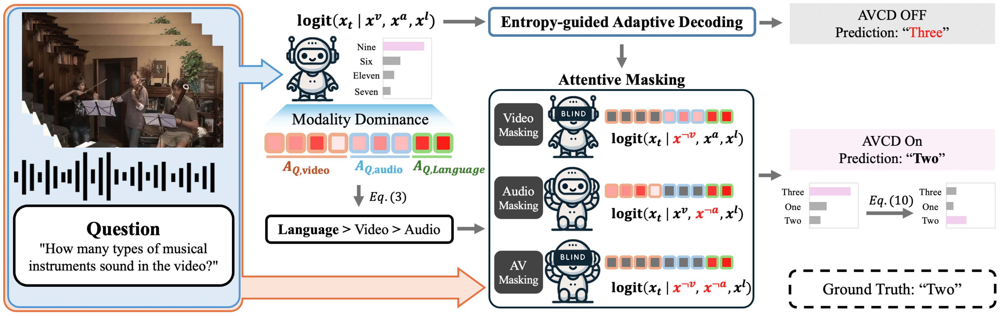

# AVCD: Mitigating Hallucinations in Audio-Visual Large Language Models through Contrastive Decoding

This is the official repository for **[Audio-Visual Contrastive Decoding (AVCD)](https://arxiv.org/abs/2505.20862)**, a simple, training-free method for mitigating hallucinations in AV-LLMs during decoding **without relying on external tools**.


---

## 🚀 Updates
- ✅ AVCD code released !
- ✅ Accepted at **NeurIPS 2025**  

---



---

## 📖 Overview
- Reformulates conventional CD (Contrastive Decoding) from single-instance (e.g., video–text) to **three-modality interactions**  
- Dynamically detects the **dominant modality** and masks less dominant modalities before applying CD  
- Introduces **entropy-guided adaptive gating** to skip unnecessary forward passes and improve inference speed  

---

## ⚙️ Setup

### 1. Environment
Follow the [VideoLLaMA2 repository](https://github.com/DAMO-NLP-SG/VideoLLaMA2) setup guide (**audio-visual branch**):


### 2. Datasets 
We use the **AVHBench** and **MUSIC-AVQA** datasets for AVCD. The repositories are available below:

| Dataset   | Link |
|-----------|------|
| AVHBench  | [GitHub](https://github.com/kaist-ami/AVHBench) |
| MUSIC-AVQA| [GitHub](https://github.com/GeWu-Lab/MUSIC-AVQA) |

### 3. Repository layout
The data and scripts for running inference and evaluation are organized as follows:

| Purpose              | Path |
|----------------------|--------------------------|
| Data QA files         | `json/` |
| Inference scripts    | `videollama2/inference/` |
| Evaluation scripts   | `videollama2/eval/` |

### 4. Usage

```bash
git clone https://github.com/kaistmm/AVCD.git
cd AVCD
```

### 5. Inference
This stage saves the generated answers from inference. An example command for running inference with the original model is shown below:
```bash
python videollama2/inference/inference_AVH_val.py
```

To enable AVCD, add the `--use-AVCD` argument:
```bash
python videollama2/inference/inference_AVH_val.py --use-AVCD True
```

### 6. Evaluation
The inference step generates a JSON file that includes the question, the answer, and the prediction.  
During evaluation, these JSON files can be used to directly measure accuracy or compute scores using GPT-based evaluation.

**Accuracy (AVH1–3)**  
- **AVH1**: Audio-driven Video Hallucination  
- **AVH2**: Video-driven Audio Hallucination  
- **AVH3**: AV Matching  
```bash
python videollama2/eval/eval_acc.py --pred-path <path_to_preds>.json
```

**Captioning Score (AVH4)**  
- **AVH4**: AV Captioning  
```bash
python videollama2/eval/eval_caption.py --pred-path <path_to_preds>.json --output-dir <dir>
```

**Open-ended QA (MUSIC-AVQA)**
```bash
python videollama2/eval/eval_gpt.py --pred-path <path_to_preds>.json --output-dir <dir>
```

## 📝 Citation
```bibtex
@article{jung2025avcd,
  title={AVCD: Mitigating Hallucinations in Audio-Visual Large Language Models through Contrastive Decoding},
  author={Jung, Chaeyoung and Jang, Youngjoon and Chung, Joon Son},
  journal={arXiv preprint arXiv:2505.20862},
  year={2025}
}
```
